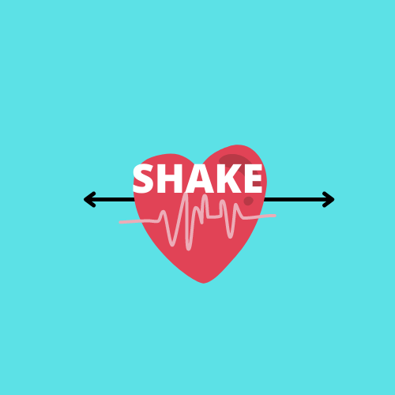
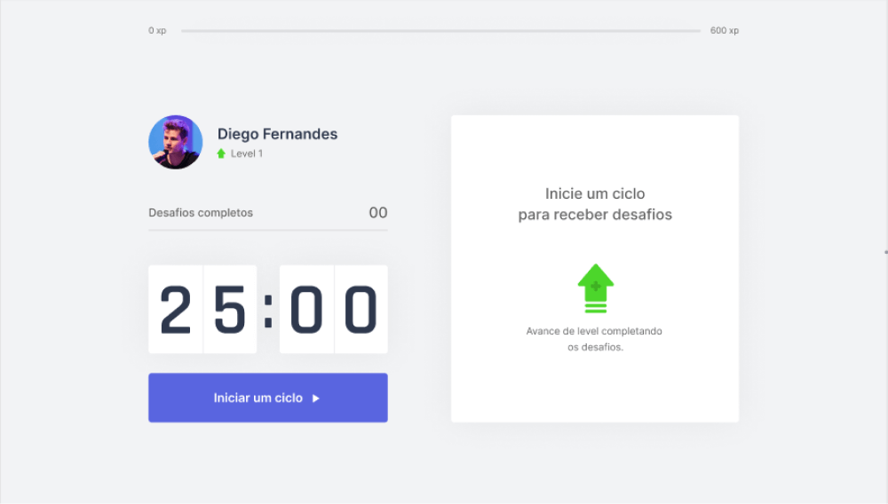

<p align="center">
   
</p>

<p align="center">	
   <a href="https://www.linkedin.com/in/ana-paula-souza-dias-b63631197/">
      
   </a>

  <a aria-label="Completed" href="https://nextlevelweek.com/episodios/react/1/edicao/4">
    </img>
  </a>
</p>

> :rocket: Move It is a project to help people to make more exercises. Next Level Week #04 #NLW @Rocketseat

<p align="center">
    <a href="README-pt.md">Portuguese</a>
 </p>

<div align="center">
  <sub>The NLW #4 project. Built with ❤︎ by
    <a href="https://github.com/AnaPaulaSouzaDias">Ana Paula</a>  
  </sub>
</div>


<h2 align="left"> 📥 Layout available for download at: </h2>
<p align="center">
    <a title="Download .fig Web" href="https://www.figma.com/file/ge20pu3ofMOKoliUyKx1Nl/?viewer=1&node-id=160:2761">
        
    </a>
</p>

<div>
   
   
</div>

# :computer: Technologies
This project was made using the follow technologies:

* [Typescript](https://www.typescriptlang.org/)      
* [React](https://reactjs.org/)      
* [Next.js](https://nextjs.org/)      
     

# :rocket: Features

* Pomodoro timer.
* Help to get up of chair and make some exercise.

# :construction_worker: How to run
```bash
# Clone Repository
$ git clone https://github.com/AnaPaulaSouzaDias/Shake-next
```

### 💻 Run Web Project

```bash
# Install Dependencies
$ yarn install

# Run Aplication
$ yarn dev
```
Go to http://localhost:3000/ to see the result.


# :closed_book: License

Released in 2020 :closed_book: License

Made with love by [Ana Paula Souza Dias](https://github.com/AnaPaulaSouzaDias) 🚀.
This project is under the [MIT license](./LICENSE).


Give a ⭐️ if this project helped you!
